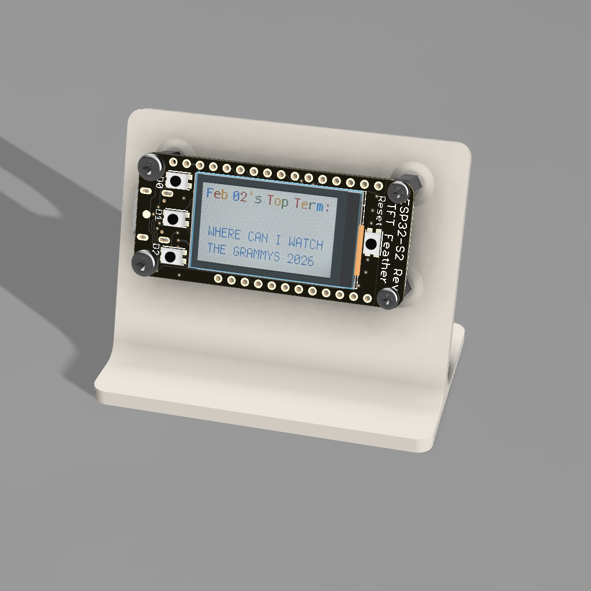
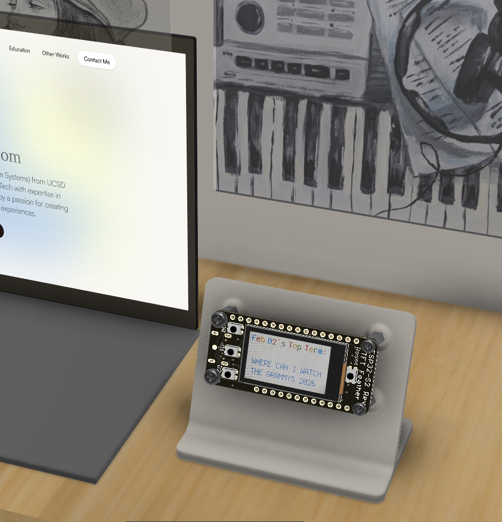
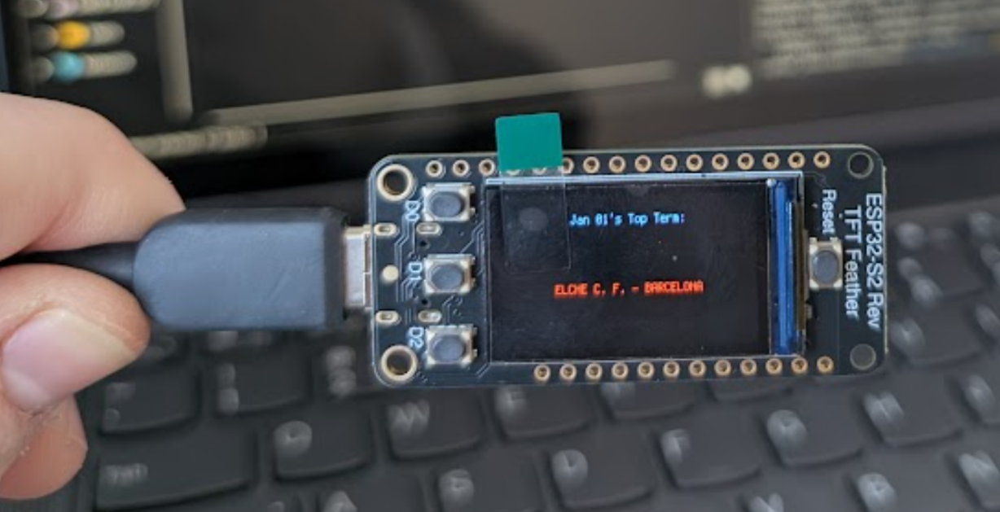
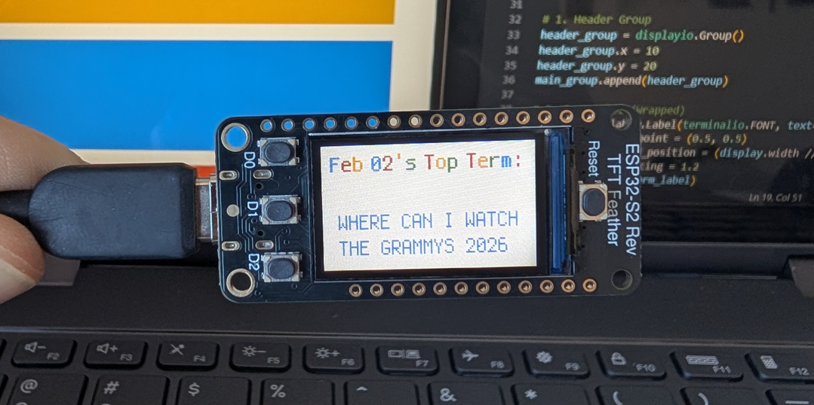

# The Google Trends Telltale
### A Piece of "Calm Technology" for the Creative Workspace

*CAD mockup of the Top Terms Telltale.*

## Concept
**What is the world searching for today?** This question is what drives the Google Trends Telltale, an ambient dashboard designed to live in every creative workspace. In an era of notification fatigue, where our attention is constantly fragmented by pings, vibrations, and banners, this device serves as a piece of **"calm technology."** It provides a silent, glanceable snippet of the world’s latest top terms without demanding the same high-stakes attention as a smartphone or computer. 

The Telltale is meant to exist in environments ranging from a personal desk to a collaborative studio at **Cornell Tech**, where people are often deep in thought or in the "flow state" between complex tasks. Sitting on a shelf or desk, it offers a glimpse into the most significant cultural moments of the day, acting more like a digital barometer of human curiosity than a traditional communication tool. It doesn’t beep or flash; rather, it simply exists as a part of the room’s atmosphere, updating its content to reflect the shifting interests of millions of people across the globe.

---

## Technical Architecture
The information displayed is retrieved through a three-stage pipeline starting with the **Google Trends BigQuery Public Dataset**. This dataset is part of a massive repository of global search behavior, but it presents a significant technical challenge for a low-power microcontroller. 

### The Cloud Backend
Because the **ESP32-S2 Reverse TFT Feather** lacks the processing power and memory overhead to query a multi-terabyte database directly, I implemented a **Google Cloud Function** written in Python to act as a secure and efficient intermediary. Every hour, the Feather wakes up from its idle state and sends an HTTP GET request to this function, which then executes an optimized SQL query on the backend. 

This architecture is vital for maintaining the "calm" nature of the device; by offloading the heavy lifting of data processing to the cloud, the hardware remains energy-efficient and responsive. The query itself is specifically designed to handle the 24-to-48-hour propagation lag inherent in public data exports. Instead of failing on a hardcoded "today" date that may not have been published yet, the script dynamically searches for the **maximum available refresh date**. This ensures the device always chases the freshest results available in the database, maintaining a seamless user experience regardless of update delays on Google’s end.

### On-Device Processing
Once the data reaches the device, it undergoes several layers of refinement to fit the unique physical and digital constraints of the 240x135 pixel TFT display:

* **Time Synchronization:** The device utilizes **Network Time Protocol (NTP)** to sync its internal Real-Time Clock with global atomic time, allowing it to accurately label the data as "Yesterday's Top Term" by calculating the offset between the current time and the database timestamp.
* **Pseudo-Bolding:** To overcome memory limitations of loading high-resolution font files, I developed a **"pixel-offset" technique**. The code renders the standard system font twice; the second layer is drawn with a one-pixel horizontal shift, creating a bolded, high-contrast header that is much easier to read from across a room.
* **Dynamic Text Wrapping:** Trending terms are unpredictable in length, ranging from a single word to a long sentence. I utilized a text-wrapping utility to stack long strings vertically, preventing the text from clipping off the screen.
* **Brand Styling:** To pay homage to the data source, the header cycles through the official Google brand palette: **blue, red, yellow, and green**. By alternating these colors for every character, the display gains a recognizable, playful aesthetic.

---

## Evolution of the Project

*CAD mockup of the natural environment of the Top Terms Telltale.*

| Iteration 1 | Final Iteration |
| :--- | :--- |
|  |  |
| *First Iteration of the Google Trends Tell Tale, without any styling.* | *Final Iteration, including brand styling and correct date.* |

---

## 🚀 Impact
By transforming a massive, abstract cloud database into a tactile, color-coded object, the Google Trends Telltale successfully turns "big data" into a small, meaningful, and aesthetic addition to the physical world, reminding us that there is always a global conversation happening just outside our immediate view.
